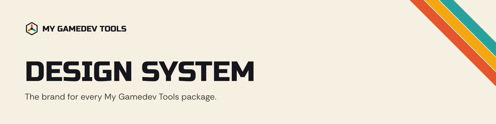

<p align="center">
  <picture>
    <source media="(prefers-color-scheme: dark)" srcset="assets/readme/banner-dark.png">
    
  </picture>
</p>

<p align="center">
  <a href="https://github.com/mygamedevtools/design-system/releases/latest"></a>
</p>

The shared look for every My Gamedev Tools package: docs sites, store pages, and the runtime UI in
package samples. Editor windows keep Unity's standard look.

- **Mark:** H1, a hexagon frame with three rounded axes
- **Theme:** Cartridge, cream and ink with tomato, amber and teal stripes, in light and dark
- **Type:** Russo One, Rethink Sans and Red Hat Mono

## Quick start

```sh
npm install
npm run dev   # builds tokens, then serves the reference site at http://localhost:4321/site/
```

The reference site shows every decision visually: logo, colors, type, components, status, store
templates and real Unity renders of the runtime UI, in light and dark. Use it to review changes before they ship.

## Layout

```
tokens/                      DTCG design tokens, the single source of truth
  base/                      palette, fonts, spacing, radius, stripes, motion
  themes/light.json, dark.json   semantic colors (--mgt-color-*), including status colors
assets/
  logo/svg, logo/png         generated by scripts/generate_logo.py
  fonts/                     OFL font files and fonts.css for the site and templates
packages/
  docusaurus-theme/          brand for Docusaurus 3 sites, shipped as a release tarball
build/                       generated tokens.css and tokens.json (site, templates)
unity/
  MyGamedevToolsUI/          UI kit for runtime screens in samples: theme, tokens, components, fonts,
                             BrandMark, CornerStripes, StatusIcon (ships as a .unitypackage)
  Examples/                  screens rendered for the reference site (not shipped)
assets/readme/               this README's banner (npm run banner)
templates/                   Asset Store icon, card, cover, social and screenshot frames; docs social card and README banner (HTML)
store/                       Asset Store kit docs and an example listing (real listings live in each package's repo)
site/                        static reference site (site/img: Unity renders)
guidelines/                  brand rules a page can't show
scripts/                     build, logo, Unity .meta generation, Unity rendering, dev server
```

## Commands

| Command | What it does |
| --- | --- |
| `npm run build` | Builds `build/tokens.css` and `tokens.json`, the Unity USS tokens and the theme's CSS and logos, and adds missing Unity `.meta` files |
| `npm run dev` | `build`, then serves the repo at http://localhost:4321/site/ |
| `npm run banner -- --name "<name>" --tagline "<tagline>" [--out <folder>]` | Renders a README banner in light and dark (`banner-light.png`, `banner-dark.png`, 2560×640) |
| `npm run logo` | Regenerates the logo SVGs and PNGs (Python: `pip install -r scripts/requirements.txt`) |
| `npm run release:pack` | Packs the Docusaurus theme to `dist/release/*.tgz` (the release workflow does this on every release) |
| `npm run store -- <listing folder>` | Renders every Asset Store image at exact size and writes the description, Third-Party Notices and a checklist to `<listing folder>/dist` |
| `npm run unity:export -- --for <package>` | Builds `dist/MyGamedevToolsUI-<package>.unitypackage` for that package's samples (GUIDs unique per package) |
| `npm run unity:render` | Renders `unity/Examples` to `site/img` with a local Unity 6 (set `UNITY` to pick an Editor) |

### Changing a color, size or font

1. Edit the JSON in `tokens/`.
2. Run `npm run build` (and `npm run logo` if a palette color used by the mark changed).
3. Run `npm run unity:render` if the change affects runtime UI, and re-export the kit for samples.
4. Check the reference site, then commit the source and the generated Unity files together.

`build/`, `packages/docusaurus-theme/src/tokens.css` and `packages/docusaurus-theme/static` are
build output and aren't committed.
`unity/MyGamedevToolsUI/Styles/Tokens.uss` and the kit's `.meta` files are committed, so the kit is
complete without a build and its GUIDs stay stable. `dist/` and `.cache/` are not committed.

## Using it

- **Docs sites:** see [packages/docusaurus-theme](packages/docusaurus-theme/README.md).
- **Unity samples:** see [the UI kit README](unity/MyGamedevToolsUI/README.md). The kit ships inside
  samples as a `.unitypackage`; games never depend on it, and editor windows don't use it.
- **Any web page in this repo:** link `build/tokens.css` and use the `--mgt-*` variables.

## Releases

Nothing is published to npm. Publishing a GitHub release runs `.github/workflows/release.yml`, which
packs the Docusaurus theme and attaches the tarball to the release; docs sites install it by URL
(see the theme's README).
Before releasing, bump `version` in `packages/docusaurus-theme/package.json` and tag the release
`v<version>`; the workflow fails if they don't match.

## License

All rights reserved; see [LICENSE](LICENSE). The fonts are third-party and stay under the SIL Open
Font License (see each `OFL.txt`).
